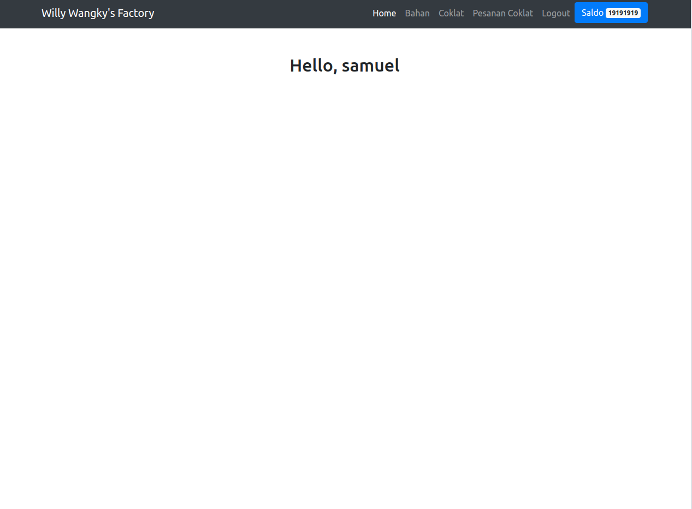
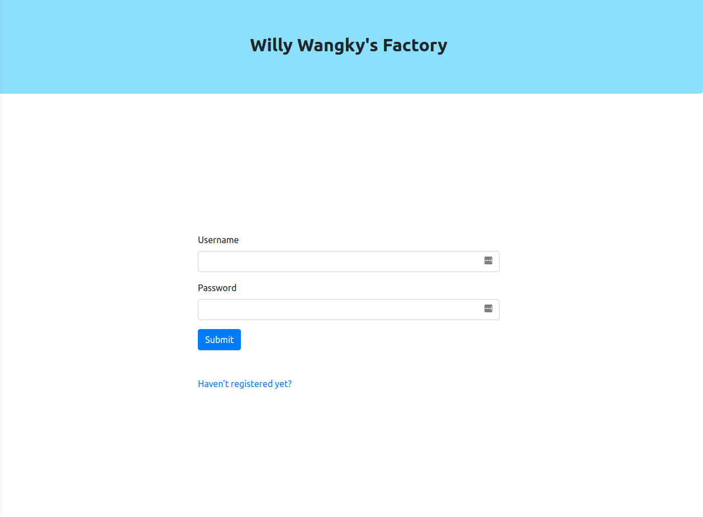
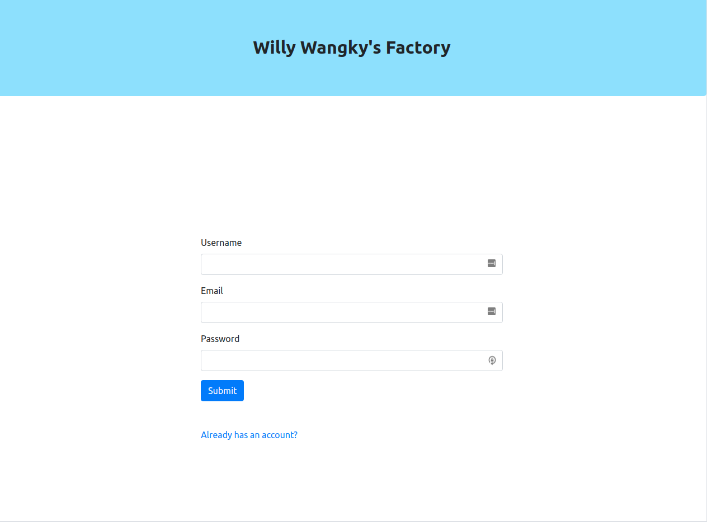
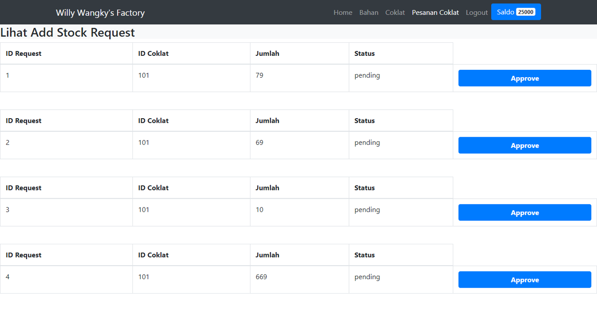

# Willy Wangky's Factory

## Deskripsi Aplikasi Willy Wangky's Factory

Willy Wangky's factory merupakan sebuah web app yang memberikan fitur interface bagi administrator pabrik untuk melakukan beberapa layanan yang disediakan oleh webservice WS Supplier dan WS Factory.

Aplikasi ini dikembangkan dengan menggunakan React.js

Untuk menjalankan aplikasi, lakukan perintah berikut:
1. Untuk menginstall dependencies
`npm install`
2. Untuk menjalankan aplikasi web (akan berjalan pada localhost:3000)
`npm start`

## Screenshot Aplikasi

## Pembagian Tugas ReactJS

1. Login dan Register: 13518041
2. Halaman Utama dan Navbar: 13518041
4. Tabel Daftar Bahan dari Pabrik: 13518017
5. Tabel Daftar Bahan dan Harga dari Supplier: 13518017
6. Pembelian Bahan ke Supplier: 13518017
7. Memberikan approval pada request add coklat dari WWWeb: 13518048
8. Melihat daftar pemesanan coklat dar WWWeb: 13518048
9. Melihat daftar Coklat pada Pabrik: 13518041
10. Melihat daftar Resep Coklat: 13518048, 13518041
11. Melihat saldo pabrik: 13518041
